How to Connect using Client Certificate Authentication
======================================================

When establishing a secure connection to your messaging service, the client will validate that the certificate of the messaging service (the server certificate) is signed by a trusted certificate authority. This confirms the identity of the server and prevents man-in-the middle attacks. Your messaging service uses a server certificate that is signed by a highly trusted public certificate authority, and will be trusted in many environments (ex. most browsers, the Java Virtual Machine). For greater security, the client can also use a certificate to prove its identity. When the client connects, the server will validate that the certificate of the client is signed by a trusted certificate authority. This is called mutual or two-way authentication.

Your messaging service supports client-certificate based authentication. However, is not enabled by default. This tutorial will walk you through the steps of using client certificate authentication. It will use the MQTT protocol because client certificate authentication is common for IoT devices and the MQTT protocol is often used in IoT environments.

While it is possible to use certificates signed by a public certificate authority, it is common that organizations set up a private certificate authority to issue client certificates. Certificates signed by a public certificate authority are expensive and are generally unnecessary. You only require a publicly signed certificate if you want to allow clients from the public to connect to your messaging service. That is typically not the case, so a private certificate authority is suitable. It is also more secure, since your organization controls the entire certificate issuing process.

The tutorial will use the widely available `OpenSSL tools <https://www.openssl.org/>`_  to create a private cerficate authority that will be used to sign the client certificates. It will also use the `MQTT.fx tool <https://mqttfx.jensd.de/>`_ to demonstrate connecting an MQTT client using that client certificate. The tool is open source and can be downloaded `here <https://mqttfx.jensd.de/index.php/download>`_.

Goals
~~~~~
The goal of this tutorial is to demonstrate how to connect a client to your messaging service using client certificate authentication. This tutorial will show you:

* How to create a private certificate authority
* How to generate a client certificate and sign it
* How to configure client certificate authentication
* How to connect an MQTT client using client-certificate authentication

Step 1: Create a Private Certificate Authority
~~~~~~~~~~~~~~~~~~~~~~~~~~~~~~~~~~~~~~~~~~~~~~

To create a private certificate authority (CA), we will use OpenSSL, which is included with most Linux-based operating systems and can be easily installed if it is not available. For details on installing OpenSSL, go `here <https://wiki.openssl.org/index.php/Binaries>`_.

To create a private CA, follow the steps below.

1. Generate a private key and a public certificate for the CA. The command below will generate two files, one for the private key and one for the public certificate.  The certificate will have a common name of *.messaging.solace.cloud.
::

    openssl req -newkey rsa:2048 -nodes -keyout MyRootCaKey.key -x509 -days 365 -out MyRootCaCert.pem -subj "/C=GB/ST=London/L=London/O=Global Security/OU=IT Department/CN=*.messaging.solace.cloud"

These files, the private key and the public certificate are all you need for your private certificate authority. Make sure you store the key file (MyRootCaKey.key) in a safe place. The certificate is public and will be uploaded to the messaging service later.

Step 2: Create a a client certificate
~~~~~~~~~~~~~~~~~~~~~~~~~~~~~~~~~~~~~

Once the private CA files are created, follow the steps below to create a client certificate.

1. Create a private key for the client. The client private key file (client1.key) will be needed when the client connects to the messaging service. Keep this file safe as well.
::
    openssl genrsa -out client1.key 2048

2. Create a certificate signing request (CSR) for the client. The common name for the client certficate will be client1.messaging.solace.cloud. The common name is important since it will be used to identify the client.
::
    openssl req -new -key client1.key -out MyClient1.csr -subj "/C=GB/ST=London/L=London/O=Global Security/OU=IT Department/CN=client1.messaging.solace.cloud"

3. Issue the client certificate using the private CA key and certficate created in the previous step.
::
    openssl x509 -req -in MyClient1.csr -CA MyRootCaCert.pem -CAkey MyRootCaKey.key -CAcreateserial -out clientCert1.pem -days 1024 -sha256

The following two files need to be accessible by the client:

* client1.key. This is the private key for the client. Keep this file safe.
* clientCert1.pem. This is the client certificate which has been signed by our private CA. It will be used to authenticate the client with the messaging service.

Step 2: Create a Queue using the Queue management window
~~~~~~~~~~~~~~~~~~~~~~~~~~~~~~~~~~~~~~~~~~~~~~~~~~~~~~~~

From the Management tab you can open the Queue management window where you can work with queues in your messaging service.

To create a queue, follow the steps below.

1. Click on the **Queues** tile on the Management tab. This will open the Queue management window in a new browser tab.

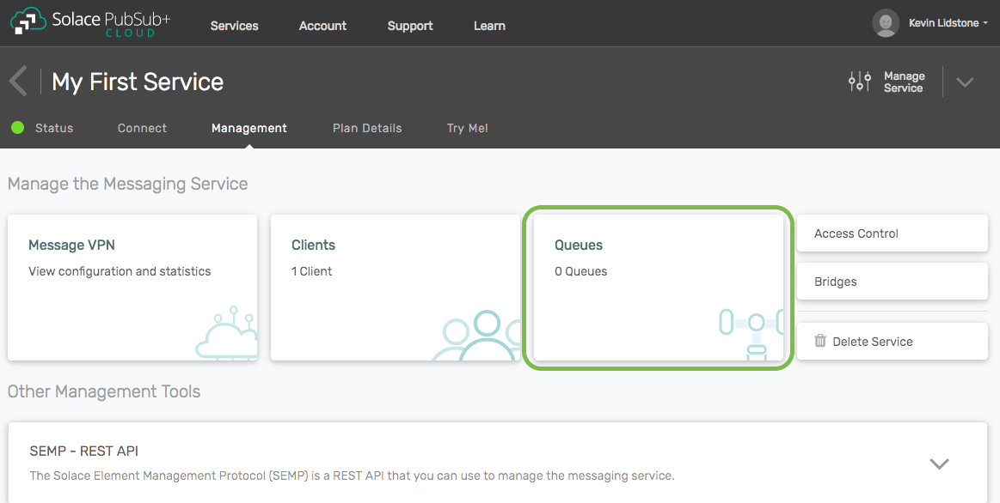

2. Click on the **+Queue** button.

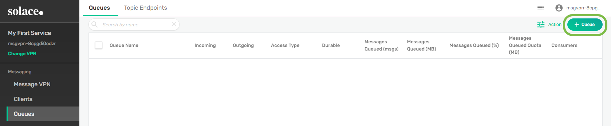

3. Enter a name for your queue and click **Create**. You can use most characters in your queue name, including spaces. Some punctuation marks ('<>*?&;) are not allowed. If you use a slash (/) in the name, it cannot be the first character.

.. raw:: html

    

4. When prompted to adjust the queue settings, click on **Apply** to accept all the default settings.

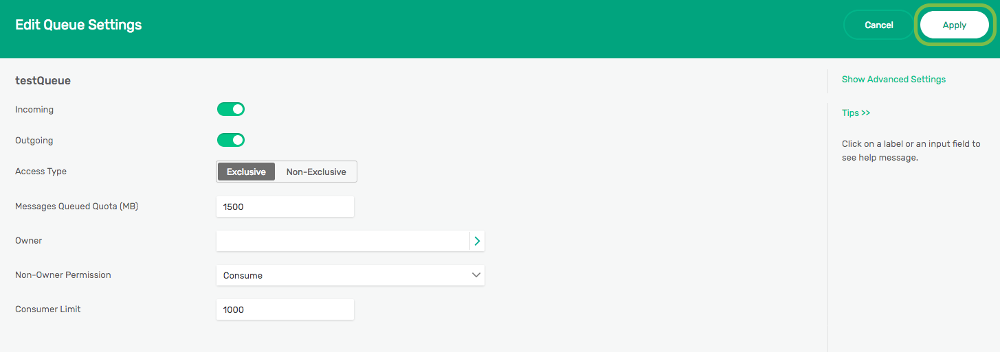

5. Your new queue will be displayed on the summary page. The queue is empty, so you will see zeros (0) in both the Messages Queued columns.

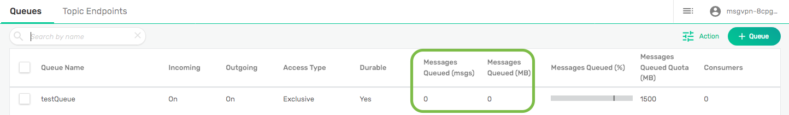

Step 3: Map a topic to queue
~~~~~~~~~~~~~~~~~~~~~~~~~~~~

While it is possible to publish directly to a queue by its name, it is common to map a topic to a queue for more flexibility. In this case, mapping a topic to a queue will allow us to use the Try Me! tab to publish a message to our queue to test it out.

To map a topic to a queue, follow the steps below.

1. From the queue summary, click anywhere in the row describing the queue to open the queue detail view.

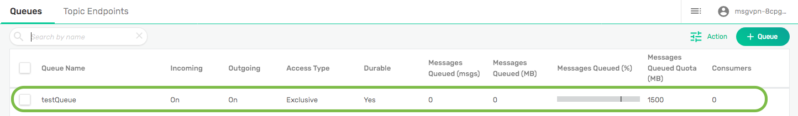

2. From the queue detail view, click on the **Subscriptions** tab.

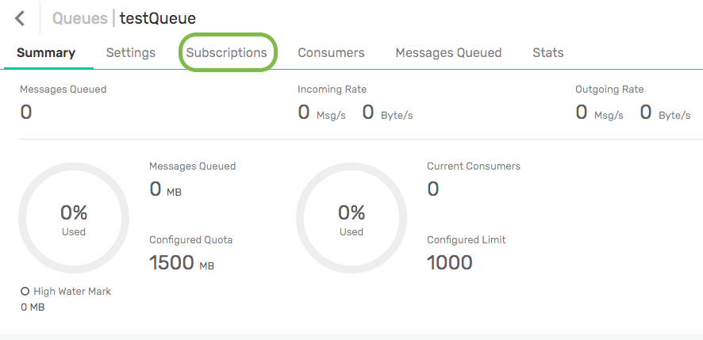

3. On the **Subscriptions** tab, click on the **+Subscription** button.

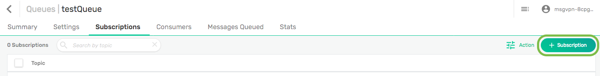

4. Enter the topic "try-me" as the subscription and click on the **Create** button. This is the default topic of the Try Me! tab.

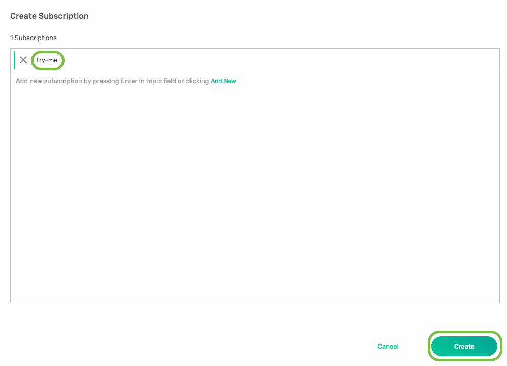

5. The topic "try-me" is now mapped to the queue. Messages published to that topic will go into the queue.

Step 4: Test the queue using the Try Me! tab
~~~~~~~~~~~~~~~~~~~~~~~~~~~~~~~~~~~~~~~~~~~~

We will use the publisher `CodePen <https://codepen.io/>`_ project on the Try Me! tab to publish a message into our queue. We are not going to use a subscriber connection.

To publish a message to the queue, follow the steps below.

1. Return to the main Solace Cloud browser tab and navigate to the **Try Me!** tab.

.. image:: ../img/tryMe_1.png

2. Click on the connect button under step 1 on the publisher CodePen.

.. raw:: html

    

3. Validate publisher connection.

.. raw:: html

    

4. Publish a message with **try-me** as the topic name under step 2 on the publisher CodePen.

.. raw:: html

    

Step 5: Confirm message is in the queue
~~~~~~~~~~~~~~~~~~~~~~~~~~~~~~~~~~~~~~~

We will use the Queue management tab to confirm that message we published in the previous step is now in the queue.

To publish a message to the queue, follow the steps below.

1. Return to the main service management browser tab and display the queue summary view by clicking on **Queues** in the left menu.

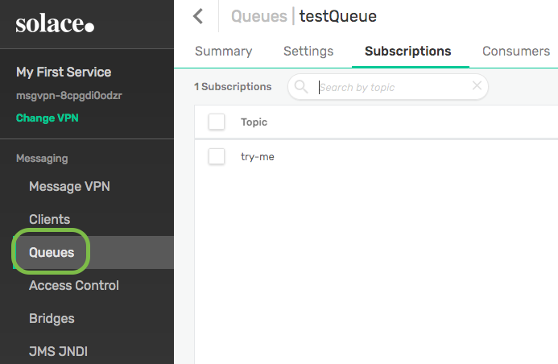

2. In the summary page, you will see your queue. The Messages Queued columns will now show 1 message in the queue with a non-zero value of bytes. Congrats, your queue is working correctly.

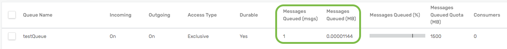

3. If you want to see more details about the message in the queue, click on anywhere in the row describing the queue and then navigate to the **Messages Queued** tab. For example, you can see the message ID assigned to the message and the time when it was published.

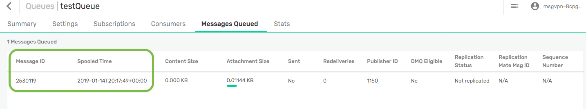

Step 6: Learn more
~~~~~~~~~~~~~~~~~~~~~~~~~~~~~~~~~~~~~~~~~~~~~~~~~~

Well done. You've now created a queue in your messaging service and published a message to it. Want to learn more?

* Try one of the API samples in GitHub, including samples on working with queues:
    * :doc:`Solace Messaging APIs <../group_quick_starts/gqs_using_messaging_apis>`.
    * :doc:`Open Messaging APIs <../group_quick_starts/gqs_using_open_apis>`.
* Learn how to manage your messaging service with our :doc:`REST Management APIs <../group_quick_starts/gqs_using_management_apis>`.
* Learn more about queues and `guaranteed messages <https://docs.solace.com/Features/Guaranteed-Messages.htm>`_.
